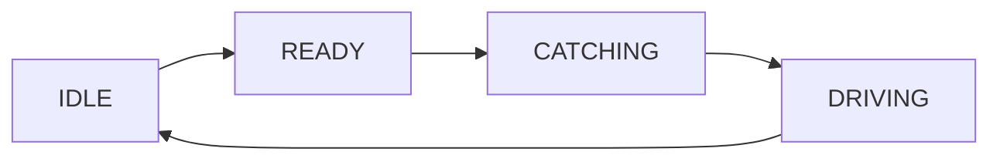
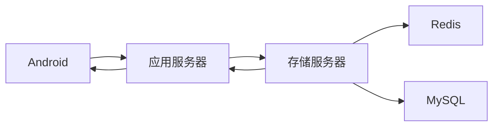

# QT基于Android+Libevent+MySQL+高德地图实现的移动端打车软件设计

- 前端界面由Android完成，后端服务器由Libevent搭建的https应用服务器作为架构中间件与数据存储服务器组成

- 该系统实现了对市面上流行的滴滴/Uber打车业务的简化版实现，主要提供了以下功能 
  - 司机/乘客的登录和注册
  - 司机界面的地图定位，点击按钮开始接单/点击弹窗接收订单/点击按钮乘客上车/点击按钮结束订单；整个过程地图显示司机实时定位，开始接单后直到订单结束一致显示司机和乘客的坐标于地图上；订单结束后重置界面直到下一个业务开始
  - 乘客界面地图定位，点击按钮下单，除非周围没有合适司机弹窗显示重新下单，成功后乘客界面无需操作直到订单结束重置

## 前端Android

- 前端界面由Android完成，主要提供了一个界面提供`登录`和`登录`两个功能根据司机/乘客的身份标识跳转到司机/乘客的Andoroid界面

- 乘客界面，用高德地图提供的接口搭建了地图显示定位窗口，同时提供了一个下单的Button，Button文本在一次点击成功下单并被接单后会根据业务自行改变显示乘客状态机状态

  ```mermaid
  graph LR
  A[IDLE] --> B[WAITING]
  	B --> C[TRAVELLING]
   
      C --> A[IDLE]
   
  ```

  

- 司机界面，用高德地图提供的接口搭建了地图显示定位窗口，同时提供了

  一个Button用于完成自己的业务逻辑,Button上的文本也会根据司机的状态机而改变


​	



- Android与应用服务器通信采用HTTP 协议，由CURL发送POST请求

## 应用服务器

- 应用服务器由Libevent搭建HTTPS服务器
- 应用服务器作为架构中间件，前端通过接口开启核心业务逻辑，应用服务器提供了`登录`，`注册`，`下单`，`定位上传`，`结束订单` 五个接口同样也是五种业务逻辑
- 前端Android界面与应用服务器的逻辑都是基于订单orderid和乘客/司机的状态机来完成的
- 应用服务器与存储服务器通信采用HTTP协议，由CURL发送POST请求





## 存储服务器

- 存储服务器由Libevent搭建HTTPS服务器
- 存储服务器提供了热点数据[Redis]缓存功能和用户信息，订单信息的持久化功能[MySQL]
- 主要涉及到了Redis缓存表四张
  - 乘客临时信息映射表（Hash）
  - 司机临时信息映射表（HASH）
  - 临时订单表（HASH）
  - 司机GEO坐标池（GEO）
- 主要涉及的MySQL数据表
  - 用户表（司机/乘客）
  - 订单表

## 项目部署

### Andoroid部署

- 项目的开发是在`AndroidStudio`,采用adb真机调试（用于通过电脑端与真实设备交互）将开发的APP安装到通过USB连接到电脑上的Android
- Android安装应用程序与手机是将程序打包成APK文件传输到手机上再执行安装操作，Android会将所有APK文件识别为应用程序安装包


### 应用服务器部署

- 应用服务器的部署，只需再服务器上运行该脚本文件start-up.sh即可


```			kill -9 `ps aux | grep "OBO_web_server" |grep -v grep | awk '{print $2}'```

```	#启动web服务器```

```#服务器接收参数，在本机，18888端口启动服务器，&表示后台运行·```

```	./OBO_web_server 18888 &```


- 应用服务器目录结构


### 存储服务器

存储服务器的部署，需要先创建一个/conf目录，目录结构如下所示


- redis.conf 

  是用来启动redis时需要指定的配置文件

- redis_6380.pid

  这个文件是因为，在redis.conf中指定redis为守护进程方式运行时（daemonize参数）（默认不是守护进程），系统会默认把pid写进配置文件中pidfile参数指定的文件（6380是redis设置的监听端口）

  


- OBO_server_data.conf

  存放了存储服务器Redis和MySQL的连接信息，在本配置文件中，redis和mysql均部署在同一台机器上，分开部署时只需修改ip+port即可


存储服务器的启动，运行脚本start-up.sh

```kill -9 `ps aux | grep "OBO_data_server" |grep -v grep | awk '{print $2}'```

```#启动redis-server，MySQL自行提前启动```
```redis-server ./conf/redis.conf```

```#启动web服务器，指定端口后台运行服务器```
```./OBO_data_server 18889 &```


- grep -v grep 是去除包含grep的进程行 ，避免影响最终数据的正确性


## 说明

本项目是基于刘丹冰老师的项目的自我学习记录总结


